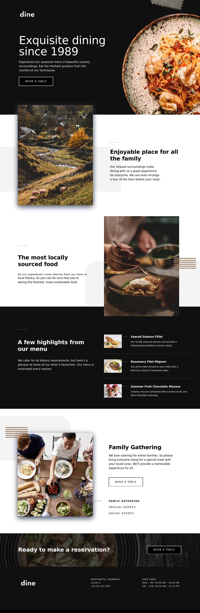

# Frontend Mentor - Dine Website Challenge solution

This is a solution to the [Dine Website Challenge challenge on Frontend Mentor](https://www.frontendmentor.io/challenges/dine-restaurant-website-yAt7Vvxt7). Frontend Mentor challenges help you improve your coding skills by building realistic projects.

## Table of contents

- [Overview](#overview)
  - [The challenge](#the-challenge)
  - [Screenshot](#screenshot)
  - [Links](#links)
- [My process](#my-process)
  - [Built with](#built-with)
  - [What I learned](#what-i-learned)
  - [Continued development](#continued-development)
  - [Useful resources](#useful-resources)
- [Author](#author)
- [Acknowledgments](#acknowledgments)

**Note: Delete this note and update the table of contents based on what sections you keep.**

## Overview

### The challenge

Users should be able to:

- View the optimal layout for each page depending on their device's screen size
- See hover states for all interactive elements throughout the site
- See the correct content for the Family Gatherings, Special Events, and Social Events section when the user clicks each tab
- Receive an error message when the booking form is submitted if:
  - The `Name` or `Email Address` fields are empty should show "This field is required"
  - The `Email Address` is not formatted correctly should show "Please use a valid email address"
  - Any of the `Pick a date` or `Pick a time` fields are empty should show "This field is incomplete"

### Screenshot



### Links

- Solution URL: [Add solution URL here](https://your-solution-url.com)
- Live Site URL: [Add live site URL here](https://your-live-site-url.com)

## My process

### Built with

- React Native syntax
- Nativewind limitations of version 4.1.23
- Proritizing Web context
- Custom components for React Native tags
- SVG images to React components transformation
- Desktop-first workflow
- [React Native](https://reactnative.dev/) - JS framework.
- [Nativewind](https://www.nativewind.dev) - TailwindCSS for React Native.
- [Expo Go](https://expo.dev/) - Universal native apps with React that run on Android, iOS, and the web.

### What I learned

Explore the powers of the 'clsx' libary:

```js
const ButtonBaseClasses = "py-4 px-11 w-fit border-2 my-8 group";
const ButtonTheme =
  theme === "black"
    ? " border-white bg-black hover:bg-white hover:border-black"
    : " border-black bg-white hover:bg-black hover:border-white";

const textBaseClasses = "font-spartan text-c_17 uppercase text-center";

const TextTheme =
  theme === "black"
    ? "text-white group-hover:text-black"
    : "text-black group-hover:text-white";

const buttonClasses = clsx(ButtonBaseClasses, ButtonTheme, className);
const textClasses = clsx(textBaseClasses, TextTheme, className);
```

### Continued development

Contune the migration to React Native syntax and funtionalities to make solutions not only for Web but also for mobile as natives APPs.

### Useful resources

- [Expo Go](https://www.youtube.com/watch?v=XgWENEf3oFw&list=PLC3y8-rFHvwgVmqbtQkPDxkvDf6w5_eGA) - Frontend Made Easy.
- [Nativewind](https://www.nativewind.dev/getting-started/installation) - Documentation.

## Author

- Website - [Thomas TS](https://buildesign.vercel.app/)
- Frontend Mentor - [@ttsoares](https://www.frontendmentor.io/profile/ttsoares)
- Linkedin - [thomas-soares-6791781b/](https://www.linkedin.com/in/thomas-soares-6791781b/)

## Acknowledgments

Mentorship of different AIs like ChatGPT, DeepSeek and Windsurf.
